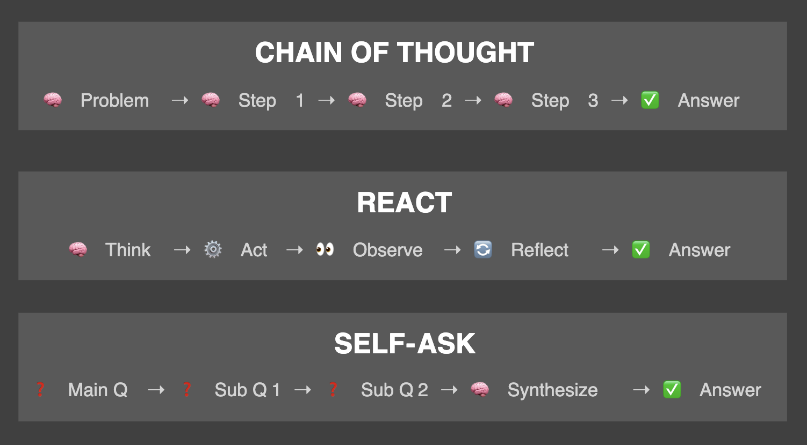

# AAIDC Module 1 Project: Foundations of Agentic AI – Your First RAG Assistant

Agentic AI Development Course

Full Course GitHub repo: https://github.com/readytensor/rt-agentic-ai-certification 

All resource at KLGiantDev Server 
/home/lukacsk/Development/AgenticAIDevelopmentCourse

https://app.readytensor.ai/lessons/4n07ViGCey0l

First Week Github Repo: https://github.com/readytensor/rt-agentic-ai-cert-week1 

Full program Github: https://github.com/readytensor/rt-agentic-ai-certification 

## Week 1

- 1.1 What is Agentic AI (AAIDC-Week1-Lesson-1) https://app.readytensor.ai/lessons/g8QivAEShqgw
- 1.2 The Core Components of AI Agents (AAIDC-Week1-Lesson-2) https://app.readytensor.ai/lessons/O8OHY0ehCvdr 
- 1.3 Real-World Applications and Use Cases of Agentic AI (AAIDC-Week1-Lesson-3) https://app.readytensor.ai/lessons/EbfPXrWQMeCh
- 1.4 Agentic AI: Tools of the Trade (AAIDC-Week1-Lesson-4) https://app.readytensor.ai/lessons/hjbeURATH5ul 
- 1.5 Agentic AI: Agents vs. Workflows (AAIDC-Week1-Lesson-5) https://app.readytensor.ai/lessons/Xq3L2HSWLPou 

### Other suggested articles

- Building effective agents: https://www.anthropic.com/engineering/building-effective-agents 

## Week 2

GitHub repo: https://github.com/readytensor/rt-agentic-ai-cert-week2 

- 2.1 Getting Started with Agentic AI: Free APIs and Local LLM Options (AAIDC-Week2-Setup) https://app.readytensor.ai/lessons/HMONylFlvgvC 
- 2.2 Building Prompts for Agentic AI Systems (AAIDC-Week2-Lesson-1a) https://app.readytensor.ai/lessons/36Hu3DC3TLdu  
- 2.3 Prompt Engineering: Advanced "Reasoning" Techniques (AAIDC-Week2-Lesson-1b) https://app.readytensor.ai/lessons/3jI5t1hwF8wM 
- 2.4 From Text to Data: Hands-On LLM Output Parsing (AAIDC-Week2-Lesson-2) https://app.readytensor.ai/lessons/LHMxs5Dtsv26 
- 2.5 Building Intelligent Pipelines: A Guide to LLM Function Chaining (AAIDC-Week2-Lesson-3) https://app.readytensor.ai/lessons/X51gr9ZwohcW 
- 2.6 Vector Databases: How AI Finds Meaning, Not Just Keywords (AAIDC-Week2-Lesson-4a) https://app.readytensor.ai/lessons/Zdrul0fG17Mg 
- 2.7 Vector Databases: Building a Semantic Retrieval System (AAIDC-Week2-Lesson-4b) https://app.readytensor.ai/lessons/hwjIdxHZGASQ 
- 2.8 Introduction to RAG (Retrieval Augmented Generation) Systems (AAIDC-Week2-Lesson-5) https://app.readytensor.ai/lessons/3Ht58iNXuvS7

### Most important things

- We need Prompt library in Yaml: https://youtu.be/yeC66lAMbyQ 
- LLMs can handle complex tasks, but when prompted casually, they often skip steps, jump to conclusions, or give surface-level answers. Why? Because under the hood, these models aren't reasoning—they're predicting the next word in a plausible sequence. -> **Chain of Thought, ReAct, and Self-Ask**
- Chunks of 300-800 tokens typically work well. They're long enough to preserve context but short enough to maintain focus on specific topics.

**Chain of Thought** (CoT) follows a linear progression - break the problem down, work through each piece systematically, then synthesize. This mirrors how humans solve math problems or **work through logical puzzles**.

**ReAct** cycles between thinking and doing - consider options, take action, observe results, reflect, then repeat. This matches how humans troubleshoot issues or navigate **complex decisions with multiple variables**. (detective solving a case)

**Self-Ask** starts broad and narrows down - identify what you need to know, ask the right sub-questions, answer each one, then bring it all together. This reflects how humans approach **research or analysis** where the full scope isn't immediately clear. (investigative journalism)

When we say an LLM is using "reasoning" techniques, we need to be honest about what's actually happening under the hood. These models aren't thinking, deliberating, or having insights. They're sophisticated pattern-matching systems performing structured text generation. Let's not forget that modern LLMs are still just doing next-word (token) prediction.

Know when to use each technique: Chain of Thought for logical, step-by-step problems. ReAct for multi-step investigations. Self-Ask for complex, multi-faceted questions.

#### The Fresh Data Challenge

One of RAG's strengths is that you can update your knowledge base without retraining. But keeping that knowledge base current requires discipline. Old publications with outdated approaches might still rank highly in searches, leading to responses that reference superseded techniques or deprecated tools.

Unlike fine-tuning where you control exactly what the model learns, RAG systems need ongoing curation to ensure the most current and accurate information surfaces first.

### Other suggested articles

- One Model, Five Superpowers: The Versatility of Variational Auto-Encoders : https://app.readytensor.ai/publications/yzN0OCQT7hUS

- CoT: https://arxiv.org/abs/2201.11903 
- ReAct: https://arxiv.org/abs/2210.03629 
- LangChain RAG Chat: https://docs.langchain.com/oss/python/langchain/rag 

## Week 3

You’ll learn how to:

- ✅ Make your first LLM calls and get comfortable with Groq and LangChain
- ✅ Use system prompts to shape your assistant’s style and responses
- ✅ Manage conversation memory for longer interactions
- ✅ Bring in retrieval to select the most relevant parts of a publication using vector databases like Chroma
- ✅ Keep your system safe, secure, and robust
- ✅ Explore best practices for optimizing and scaling your assistant

Links and daily Lessons:

- 3.1 Week 3 Preview: Your RAG Assistant Toolkit (AAIDC-Week3-Preview) https://app.readytensor.ai/lessons/gleIJzLtXA3m 
- 3.2 Your First LLM Calls: Getting Started with Groq & LangChain (AAIDC-Week3-Lesson-1) https://app.readytensor.ai/lessons/BJbtjKH15JHb 
- 3.3 System Prompts: Your AI's Operating Manual (AAIDC-Week3-Lesson-2) https://app.readytensor.ai/lessons/t79Iyg4lva2t
- 3.4 Memory Management Strategies: When Conversations Get Too Long (AAIDC-Week3-Lesson-3a) https://app.readytensor.ai/lessons/WCVvtUtH3N1o
- 3.5 Memory Persistence: Saving Conversations Across Sessions (AAIDC-Week3-Lesson-3b) https://app.readytensor.ai/lessons/Ax1KnCSIt9QI
- 3.6 Building Your Research Assistant: A Step-by-Step RAG Implementation (AAIDC-Week3-Lesson-4) https://app.readytensor.ai/lessons/IBOMURRgN8Dn
- 3.7 RAG-Based AI Assistant Template: Complete Your Module 1 Project (AAIDC-Week4) https://app.readytensor.ai/lessons/exE2ntdB3aIr 
- 3.8 Project 1 Submission Guidelines - Agentic AI Developer Certification (AAIDC-Week4) https://app.readytensor.ai/lessons/BblNcQTBi5Os

### Most important things

**Variational Autoencoders (VAEs)** are a type of deep learning algorithm that combines the concepts of autoencoders and variational methods. They are neural networks that learn to compress and reconstruct high-dimensional data, such as images or text, into lower-dimensional representations.

**System prompts** are your AI's operating manual - the foundational instructions that define personality, behavior, and boundaries for every single response, no matter what users System Prompts serve the following purposes in Agentic AI systems:

#### System Prompt

✅ Role and Personality
They define who the AI is. Are they a helpful research assistant? A trusted data analyst? A professional customer support agent? The system prompt makes this explicit, so your assistant always knows its role.

✅ Behavior and Tone
System prompts shape how the AI speaks. Should the responses be friendly and informal, or concise and formal? Bullet points or paragraphs? The system prompt sets the style and voice that matches your brand and your users’ expectations.

✅ Scope and Boundaries
They are your first line of defense to control what your AI talks about — and what it doesn’t. In a RAG system, for example, it might say:

“Only answer based on the provided publication. If the question goes beyond the scope, politely refuse.”
This stops the AI from hallucinating answers or wandering into topics it shouldn’t cover.

✅ Safety and Ethics
System prompts anchor your assistant’s ethical behavior:

Refuse to help with unethical or illegal activities.
Avoid sharing sensitive or proprietary information.
Provide disclaimers when information is incomplete.
It’s like the AI’s conscience, making sure it upholds your standards of responsibility.

✅ Output Format
Finally, system prompts can define how answers are structured — for example:

“Respond in concise bullet points.”
“Summarize key points in a numbered list.”
“Always include a final takeaway.”
This ensures consistent, clear, and professional outputs every time.

#### Success Criteria

You’ve completed the project when:

You can add your own documents to the data/ folder
The system loads, chunks, embeds, and stores them
Queries return relevant results
The assistant generates meaningful, contextual answers
You can switch between LLM providers via environment variables

### Other suggested articles

None.